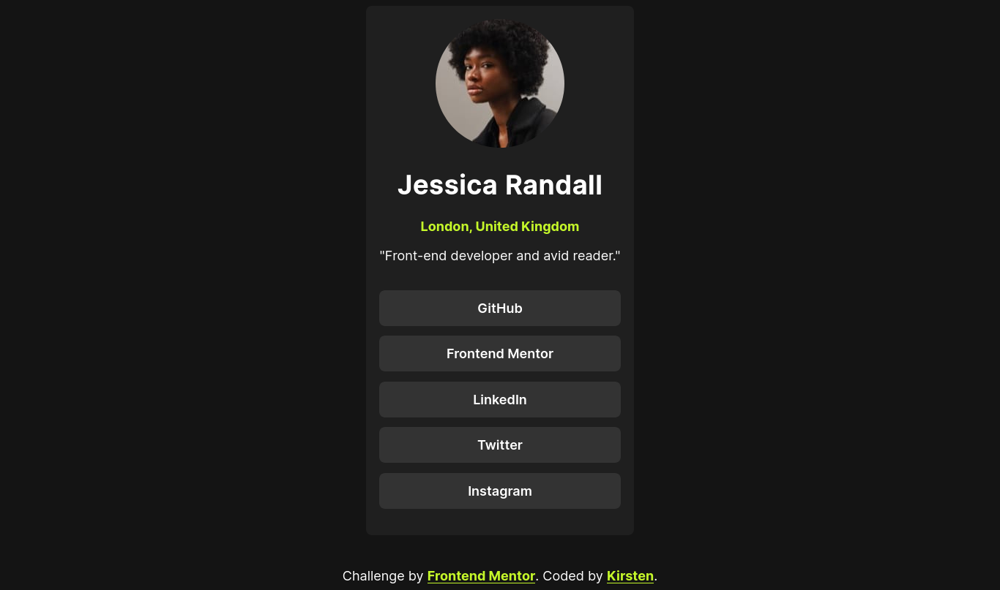

# Frontend Mentor - Social links profile solution

This is a solution to the [Social links profile challenge on Frontend Mentor](https://www.frontendmentor.io/challenges/social-links-profile-UG32l9m6dQ). Frontend Mentor challenges help you improve your coding skills by building realistic projects. 

## Table of contents

  - [The challenge](#the-challenge)
  - [Screenshot](#screenshot)
  - [Links](#links)
  - [My process](#my-process)
  - [Built with](#built-with)
  - [Author](#author)

### The challenge

This is a social links challenge, users are able to see their links and all active states on hover, focus and active. 

### Screenshot

This is a full-screen screenshot of my solution, without the hover states. 

### Links

- Solution URL: [https://github.com/ofthewildfire/social-links-profile](https://github.com/ofthewildfire/social-links-profile)
- Live Site URL: [https://social-links-profile-green.vercel.app/](https://social-links-profile-green.vercel.app/)

## My process

I began with the HTML and then I completed the CSS, due to the simplicity of this challenge, I was able to just create this within the CSS from a desktop perspective and then make small changes to the view for mobile view. 

### Built with

- Semantic HTML5 markup
- CSS custom properties
- Flexbox
- CSS Grid
- Mobile-first workflow

## Author

- Frontend Mentor - [@ofthewildfire](https://www.frontendmentor.io/profile/ofthewildfire)
- Twitter - [@km_fsdev](https://www.twitter.com/km_fsdev)

